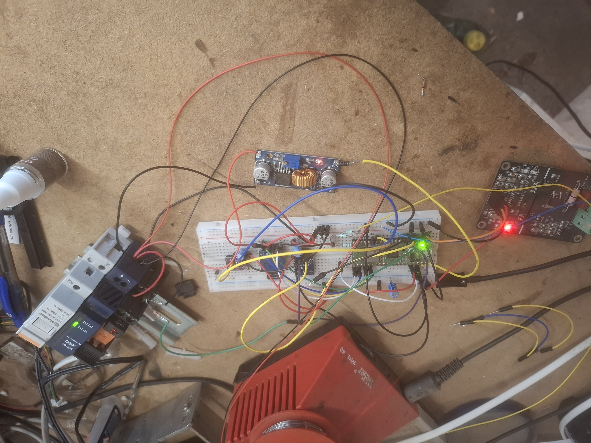

# lysstyringV2

Lysstyring til mit hus (Raspberry Pi Pico W / RP2040 + Earl Philhower Arduino core). Projektet kører dual-core: Core0 håndterer WiFi/NTP/SD/web, Core1 håndterer sensorer, automatik og dimmer.

Status: Stabil i drift med webinterface, SD-log, NTP-ur og konfiguration via SD/web.



## Funktioner (opdateret)

- Dual‑core arkitektur (RP2040)
  - Core0: WiFi, NTP/RTC, SD-kort, webserver og filbrowser
  - Core1: Sensorlæsning (BH1750, BMP280), PIR/hardwareswitch, lys-automatik og dimmerstyring
- Webinterface
  - index.htm: ON/Soft OFF, slider (0–100%), live status-opdatering
  - Understøtter flere samtidige browser‑vinduer
  - status.htm + statusjson.htm for let integration/debug
- Lys-automatik (nat/dag)
  - Lux‑baseret nat/dag-skift med justerbar forsinkelse (natdagdelay)
  - Tilstande: TIMER_A (grundlys), TIMER_C (PIR 1. fase), TIMER_E (PIR 2. fase), NIGHT_GLOW (natglød), OFF
  - To modes: “Tid” (fast varighed) eller “Klokken” (slut‑klokkeslæt året rundt)
- Dæmper (AC PWM + relæ)
  - Softstart/softsluk med justerbart step (aktuelStepfrekvens)
  - PWM 10 kHz, 16‑bit range, relæ til/frakobling af last
- Sensorer (I2C på to busser)
  - BH1750 lux på Wire (SDA=4, SCL=5 @ 100 kHz)
  - BMP280 tryk/temperatur på Wire1 (SDA=10, SCL=11 @ 1 MHz)
  - Simpel I2C‑busrecovery ved boot
- PIR og HW‑kontakt
  - 2x PIR‑indgange + hardware‑kontakt (valgfri) 24 v pir detectorer niko 41-549.
  - “Software on” lås fra web (frigøres med Soft OFF)
- SD‑logning (tidsstemplet via RTC)
  - nataktiv.log: nat/dag ON/OFF
  - pir.log: PIR1/PIR2/hardware‑kontakt/Software on/off
  - Logning kan aktiveres/deaktiveres i web (logconfig.htm)
- NTP + RTC
  - Periodisk NTP‑sync mod dk.pool.ntp.org (lokal dansk tid via TZ/localtime; NTP offset = 0)
  - RTC opdateres, anvendes til tidsstempler og “Klokken”‑mode
- Konfiguration via SD + web
  - wifi.json (SSID/password/kontrollernavn)
  - Default.json (alle automatik‑/lysparametre)
  - Opsætningssiden gemmer til SD via JSON (ArduinoJson)
- Indbygget filbrowser
  - filebrowser.htm med dirlist/download/delete/upload (multipart), auto‑mkdir
  - Nyttigt til at hente logs og lægge konfigurationsfiler

## Hardware

- Raspberry Pi Pico W (RP2040 + CYW43 WiFi)
- SD‑kort via SPI
  - MISO=16, CS=17, SCK=18, MOSI=19 (dedikeret SPI mode)
- Sensorer: BH1750 (lux), BMP280 (tryk/temperatur)
- PIR‑sensorer (2x) + hardware‑kontakt (valgfri). Testet med 24 V PIR detektorer Niko 41-549 (via passende interface).
- AC‑dimmer (Krida Electronics 8A) + relæ
- Solid PSU på VSYS anbefales; gerne ekstra bulk‑kondensator tæt på VSYS
- Detaljerede benforbindelser: se benforbindelser.txt

## Endpoints (web)

- /index.htm (default): UI for ON/Soft OFF/slider + live status
- /status.htm: tekststatus til UI
- /statusjson.htm: JSON status (lys, lux, temp, hPa, CPU‑temp, lås, tider)
- /opsaetning.htm: redigér automatik/dimmer‑parametre
- /opsaetdata.htm: gem af opsætning (GET)
- /logconfig.htm: slå nat/PIR‑log til/fra
- /gemlogconfig.htm: gem af log‑opsætning (GET)
- /filebrowser.htm: simpel filbrowser
  - /dirlist?path=/…  (JSON)
  - /download?path=/… (GET)
  - /delete?path=/…   (GET)
  - POST /upload      (multipart/form‑data; felt “path” + “file”)

## Konfiguration (SD)

- wifi.json
  ```json
  {
    "ssid": "MinSSID",
    "password": "MinKode",
    "kontrollernavn": "controller"
  }
  ```
- Default.json
  - Nøglefelt: "Default"
  - Felter (bruges i koden):
    - styringsvalg (bool; true="Klokken", false="Tid")
    - luxstartvaerdi (int/float)
    - TimerA, TimerC, TimerE (sekunder)
    - timerApwmvaerdi, timerCpwmvaerdi, timerEpwmvaerdi, timerGpwmvaerdi (0–100 %)
    - natdagdelay (sek.)
    - slutKlokkeTimer (0–23), slutKlokkeMinutter (0–59)
    - lognataktiv (bool), logpirdetection (bool)
    - aktuelStepfrekvens (1–10)
  - Eksempel:
    ```json
    {
      "Default": {
        "styringsvalg": false,
        "luxstartvaerdi": 8,
        "TimerA": 7200,
        "TimerC": 60,
        "TimerE": 60,
        "timerApwmvaerdi": 45,
        "timerCpwmvaerdi": 100,
        "timerEpwmvaerdi": 55,
        "timerGpwmvaerdi": 0,
        "natdagdelay": 15,
        "slutKlokkeTimer": 22,
        "slutKlokkeMinutter": 0,
        "lognataktiv": true,
        "logpirdetection": true,
        "aktuelStepfrekvens": 5
      }
    }
    ```

## Pin‑oversigt (standard i koden)

- SD (SPI): MISO=16, CS=17, SCK=18, MOSI=19
- I2C0 (BH1750): SDA=4, SCL=5 @ 100 kHz
- I2C1 (BMP280): SDA=10, SCL=11 @ 1 MHz
- Dimmer: PWM‑pin=0, Relæ‑pin=2
- PIR1=14, PIR2=15, HW‑switch=13
- LED_BUILTIN (on‑board LED)

Se også benforbindelser.txt for den fysiske ledningsføring.

## Krav/afhængigheder

- Arduino core: Earl Philhower RP2040
  - Husk at tilføje i platform.txt efter opdatering:
    ```
    compiler.cpp.extra_flags=-DPICO_CORE0_STACK_ADDR=0x20041000 -DPICO_CORE1_STACK_ADDR=0x20042000
    ```
- Biblioteker: SdFat, ArduinoJson, NTPClient, Adafruit_BMP280, hp_BH1750, Ticker

## Installation

1. Klon repo:
   ```bash
   git clone https://github.com/k-madsenDK/lysstyringV2.git
   ```
2. Installer afhængige Arduino‑biblioteker og Philhower RP2040‑core.
3. Tilføj stack‑flags i platform.txt (se ovenfor).
4. Kobl hardware jf. pin‑oversigt. Læg wifi.json og Default.json på SD‑kortet.
5. Upload koden til Pico W og åbn http://<enhedens‑ip>/index.htm.

## Brug

- ON: sætter “Software on” (låst ON). Soft OFF: slukker og returnerer til automatik.
- Slider: justerer lys i %; i automode midlertidigt, i låst tilstand fastholdes til Soft OFF.
- Opsætning og log‑opsætning gemmes til SD (Default.json).
- Hent logs via filbrowseren eller /download.

## Kendte forhold

- Lokal dansk tid (CET/CEST) håndteres automatisk via TZ + localtime(); NTPClient offset = 0.
- I2C bus‑recovery køres ved boot; scanning er slået fra som standard i runtime.

—  
Hobbyprojekt; leveres som‑er uden garanti.