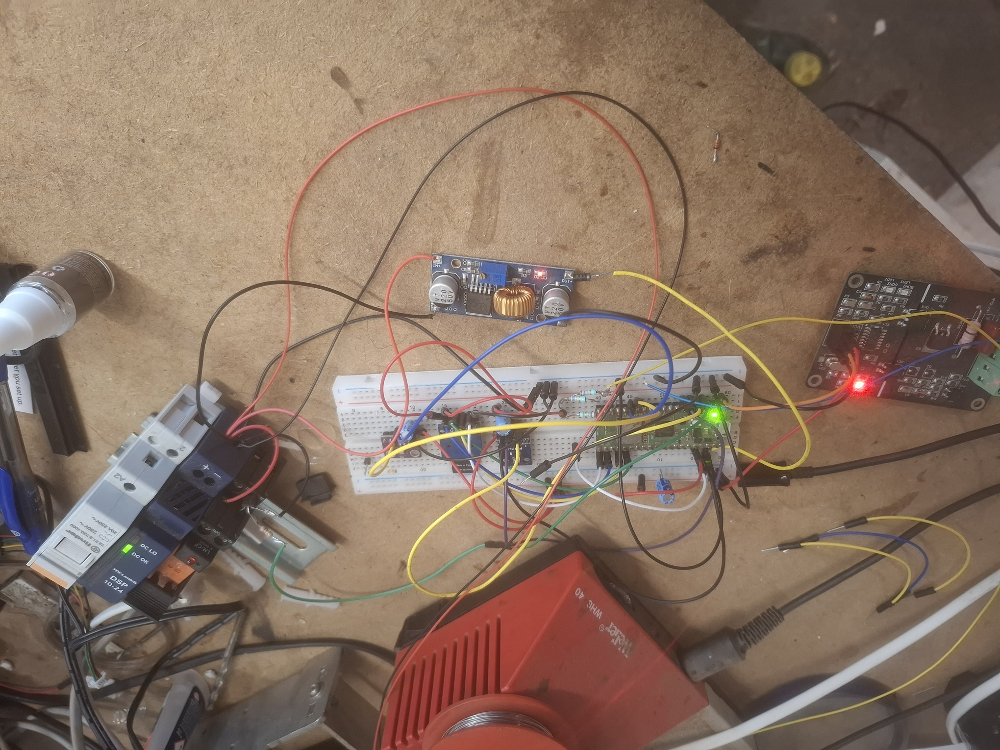

# lysstyringV2

Lysstyring til mit hus (Raspberry Pi Pico W / RP2040 + Earl Philhower Arduino core).  
Projektet kører dual-core: Core0 håndterer WiFi/NTP/SD/web, Core1 håndterer sensorer, automatik og dimmer.

**Status:** Stabil i drift med webinterface, SD-log, NTP-ur, astro-beregning og konfiguration via SD/web.



## Opdateringslog

- **VEML7700** erstatter BH1750 som lyssensor (ingen clock stretching, stabil på lange kabler).
- **Astro-mode** tilføjet: automatisk nat/dag baseret på solnedgang/solopgang med justerbare offsets.
- **Tre segmenter** (Klokken/Astro-mode): basis-segment + to valgfrie tillægssegmenter med ugedag-valg.
- **I2C bus recovery** med automatisk reset og logging ved fejl.
- **Watchdog** (3 sek) med automatisk genstart og logging.
- Minimal egen VEML7700-driver (`VEML7700_PIO.h`) uden Adafruit BusIO dependency — kompatibel med hardware Wire og PioI2C.

## Funktioner

### Dual-core arkitektur (RP2040)

- **Core0:** WiFi, NTP/RTC, SD-kort, webserver, filbrowser og FIFO-log-consumer
- **Core1:** Sensorlæsning (VEML7700, BMP280), PIR/hardwareswitch, lys-automatik, dimmerstyring og watchdog

### Webinterface

- `index.htm`: ON / Soft OFF, slider (0–100 %), live status-opdatering med ur
- Understøtter flere samtidige browservinduer
- `status.htm` + `statusjson.htm` for let integration/debug

### Lys-automatik (nat/dag)

Tre styringsmodes:

| Mode | Beskrivelse |
|------|-------------|
| **Tid** | Fast varighed (TimerA sekunder) efter nataktiv |
| **Klokken** | Segment-baseret: lys ON fra nataktiv til slut-klokkeslæt + valgfrie tillægssegmenter |
| **Astro** | Solnedgang/solopgang-baseret med offset + lux fallback + valgfrie tillægssegmenter |

- Lux-baseret nat/dag-skift med justerbar forsinkelse (`natdagdelay`)
- Tilstande: `TIMER_A` (grundlys), `TIMER_C` (PIR 1. fase), `TIMER_E` (PIR 2. fase), `NIGHT_GLOW` (natglød), `OFF`
- Astro-mode: beregner solopgang/solnedgang ud fra GPS-koordinater (lat/lon) med justerbare offsets i minutter
- Astro "lux early-start": lux kan aktivere nat før beregnet solnedgang (valgfrit)
- Segmenter (Klokken/Astro): basis-segment + segment 2 og 3 med individuel ugedag-maske (Søn–Lør)

### Dæmper (AC PWM + relæ)

- Softstart / softsluk med justerbart step (`aktuelStepfrekvens`)
- PWM 10 kHz, 16-bit range, relæ til/frakobling af last
- Testet med Krida Electronics 8A AC-dimmer

### Sensorer (I2C på to busser)

- **VEML7700** lux på Wire / I2C0 (SDA=4, SCL=5 @ 100 kHz)
- **BMP280** tryk/temperatur på Wire1 / I2C1 (SDA=10, SCL=11 @ 100 kHz)
- I2C bus recovery ved boot (9× SCL toggle + STOP condition)
- Automatisk reset af I2C-bus ved læsefejl (med logging)

### PIR og HW-kontakt

- 2× PIR-indgange + hardware-kontakt (valgfri)
- Testet med 24 V PIR detektorer Niko 41-549 (via passende interface)
- "Software on" lås fra web (frigøres med Soft OFF)
- Debounce i software (250 ms tick)

### SD-logning (tidsstemplet via RTC)

- `nataktiv.log`: nat/dag ON/OFF
- `pir.log`: PIR1/PIR2/hardware-kontakt/Software on/off
- `hardware.log`: watchdog resets, I2C resets, WiFi reconnects, astro-data (altid aktiv)
- Logning kan aktiveres/deaktiveres per kategori i web (`logconfig.htm`)

### NTP + RTC

- Periodisk NTP-sync mod `dk.pool.ntp.org` (lokal dansk tid via TZ / `localtime()`)
- NTP offset = 0 (UTC epoch) — konvertering til CET/CEST sker via `setenv("TZ", ...)`
- RTC opdateres, anvendes til tidsstempler, "Klokken"-mode og astro-beregning
- NTP epoch deles med core1 via mutex-beskyttet variabel

### Astro (solnedgang/solopgang)

- Beregning af solopgang og solnedgang ud fra dato + latitude/longitude
- Algoritme baseret på NOAA/Meeus simplified sunrise equation
- Automatisk håndtering af CET/CEST (sommertid) via TZ
- Cache: beregnes kun én gang per dato
- Daglig astro-log til `hardware.log` via FIFO (core1 → core0)

### Konfiguration via SD + web

- `wifi.json`: SSID, password, kontrollernavn
- `Default.json`: alle automatik-/lysparametre inkl. segmenter og astro
- Opsætningssiden gemmer til SD via JSON (ArduinoJson)

### Indbygget filbrowser

- `filebrowser.htm` med dirlist/download/delete/upload (multipart), auto-mkdir
- Nyttigt til at hente logs og lægge konfigurationsfiler

## Hardware

- **Raspberry Pi Pico W** (RP2040 + CYW43 WiFi)
- **SD-kort** via SPI (MISO=16, CS=17, SCK=18, MOSI=19, dedicated SPI mode)
- **VEML7700** lyssensor (I2C, adresse 0x10) — erstatter BH1750
- **BMP280** temperatur/tryk (I2C, adresse 0x76)
- **PIR-sensorer** (2×) + hardware-kontakt (valgfri). Testet med 24 V PIR detektorer Niko 41-549
- **AC-dimmer** (Krida Electronics 8A) + relæ
- Solid PSU på VSYS anbefales; gerne ekstra bulk-kondensator tæt på VSYS

### Anbefalinger til lange sensorkabler

| Kabel | Anbefaling |
|-------|------------|
| VEML7700 (2 m) | 10 µF afkobling i Pico-enden + 100 nF keramisk i sensor-enden |
| BMP280 (4 m) | 10 µF afkobling i Pico-enden |
| I2C clock | 100 kHz på begge busser |

### Korrosionsbeskyttelse

Plastik 70 spray anbefales på sensor-breakout boards i udendørs/fugtige miljøer.

## Pin-oversigt

| Funktion | GPIO |
|----------|------|
| VEML7700 SDA (Wire/I2C0) | 4 |
| VEML7700 SCL (Wire/I2C0) | 5 |
| BMP280 SDA (Wire1/I2C1) | 10 |
| BMP280 SCL (Wire1/I2C1) | 11 |
| SD MISO | 16 |
| SD CS | 17 |
| SD SCK | 18 |
| SD MOSI | 19 |
| Dimmer PWM | 0 |
| Dimmer relæ | 2 |
| PIR1 | 14 |
| PIR2 | 15 |
| HW-switch | 13 |
| LED_BUILTIN | On-board LED (heartbeat) |

Se også `benforbindelser.txt` for den fysiske ledningsføring.

## Endpoints (web)

| Endpoint | Beskrivelse |
|----------|-------------|
| `/index.htm` (default) | UI for ON/Soft OFF/slider + live status |
| `/status.htm` | Tekststatus til UI |
| `/statusjson.htm` | JSON status (lys, lux, temp, hPa, CPU-temp, lås, tider, mode, astro) |
| `/opsaetning.htm` | Redigér automatik/dimmer-parametre (mode-preview via `?previewMode=`) |
| `/opsaetdata.htm` | Gem af opsætning (GET med query params) |
| `/logconfig.htm` | Slå nat/PIR-log til/fra |
| `/gemlogconfig.htm` | Gem af log-opsætning (GET) |
| `/filebrowser.htm` | Simpel filbrowser |
| `/dirlist?path=/…` | JSON mappeliste |
| `/download?path=/…` | Download fil (GET) |
| `/delete?path=/…` | Slet fil (GET) |
| `POST /upload` | Upload fil (multipart/form-data; felt "path" + "file") |

## Konfiguration (SD)

### wifi.json

```json
{
  "ssid": "MinSSID",
  "password": "MinKode",
  "kontrollernavn": "controller"
}
```

### Default.json

```json
{
  "Default": {
    "styringsvalg": "Astro",
    "luxstartvaerdi": 8,
    "TimerA": 7200,
    "TimerC": 60,
    "TimerE": 60,
    "timerApwmvaerdi": 45,
    "timerCpwmvaerdi": 100,
    "timerEpwmvaerdi": 55,
    "timerGpwmvaerdi": 0,
    "natdagdelay": 15,
    "slutKlokkeTimer": 22,
    "slutKlokkeMinutter": 0,
    "seg2Enabled": false,
    "seg2StartTimer": 5,
    "seg2StartMinutter": 30,
    "seg2SlutTimer": 7,
    "seg2SlutMinutter": 30,
    "seg2WeekMask": 127,
    "seg3Enabled": false,
    "seg3StartTimer": 0,
    "seg3StartMinutter": 0,
    "seg3SlutTimer": 0,
    "seg3SlutMinutter": 0,
    "seg3WeekMask": 127,
    "lognataktiv": true,
    "logpirdetection": true,
    "aktuelStepfrekvens": 5,
    "astroEnabled": true,
    "astroLat": 56.1500,
    "astroLon": 10.2000,
    "astroSunsetOffsetMin": 0,
    "astroSunriseOffsetMin": 0,
    "astroLuxEarlyStart": true
  }
}
```

### Felter forklaret

| Felt | Type | Beskrivelse |
|------|------|-------------|
| `styringsvalg` | String | "Tid", "Klokken" eller "Astro" |
| `luxstartvaerdi` | float | Lux-tærskel for nat/dag-skift |
| `TimerA/C/E` | int | Varighed i sekunder (Tid-mode) |
| `timerA/C/E/Gpwmvaerdi` | int | Lysniveau 0–100 % for hver tilstand |
| `natdagdelay` | int | Forsinkelse i sekunder for nat/dag-skift |
| `slutKlokkeTimer/Minutter` | int | Segment 1 slut-tidspunkt (Klokken/Astro) |
| `seg2/3Enabled` | bool | Aktivér tillægssegment |
| `seg2/3Start/SlutTimer/Minutter` | int | Start/slut for tillægssegment |
| `seg2/3WeekMask` | uint8 | Bitmask for ugedage (bit0=Søn, bit6=Lør, 127=alle) |
| `aktuelStepfrekvens` | int | Softlys step-størrelse (1–10) |
| `astroEnabled` | bool | Master enable for astro-beregning |
| `astroLat/Lon` | float | GPS-koordinater for solopgang/solnedgang |
| `astroSunsetOffsetMin` | int | Offset i minutter til solnedgang (kan være negativ) |
| `astroSunriseOffsetMin` | int | Offset i minutter til solopgang (kan være negativ) |
| `astroLuxEarlyStart` | bool | Lux kan aktivere nat før beregnet solnedgang |

## Filstruktur

| Fil | Beskrivelse |
|-----|-------------|
| `lysstyringV2.ino` | Hovedfil: setup/loop for core0 + core1 |
| `VEML7700_PIO.h` | Minimal VEML7700 driver (hardware Wire kompatibel) |
| `LysAutomatik.h` | State machine for nat/dag, segmenter, astro og PIR |
| `AstroSun.h` | Solopgang/solnedgang-beregning (NOAA simplified) |
| `Dimmerfunktion.h` | AC-dimmer med softstart/softsluk |
| `LysParam.h` | Konfigurationsstruktur + log event enum |
| `pirroutiner.h` | PIR/HW-switch håndtering med debounce |
| `WebServerHandler.h` | HTTP router + alle web-sider |
| `mitjason.h` | JSON load/save (wifi.json + Default.json) |
| `lyslog.h` | SD-logning (nat, PIR, hardware) |
| `I2CBusRecover.h` | I2C bus recovery (9× SCL toggle + STOP) |
| `SimpleSoftwareTimer.h` | Software timer til loop-baseret callback |
| `SimpleHardwareTimer.h` | Ticker-wrapper til hardware timer |

## Krav / afhængigheder

- **Arduino core:** [Earl Philhower RP2040](https://github.com/earlephilhower/arduino-pico)
  - Husk at tilføje i `platform.txt` efter opdatering:
    ```
    compiler.cpp.extra_flags=-DPICO_CORE0_STACK_ADDR=0x2003A000 -DPICO_CORE1_STACK_ADDR=0x20042000
    ```
- **Biblioteker:**
  - SdFat
  - ArduinoJson
  - NTPClient
  - Adafruit_BMP280
  - Ticker (inkluderet i core)

> **Bemærk:** VEML7700 driveren (`VEML7700_PIO.h`) er inkluderet i projektet og kræver INGEN eksterne biblioteker — den bruger kun standard `Wire.h`.

## Installation

1. Klon repo:
   ```bash
   git clone https://github.com/k-madsenDK/lysstyringV2.git
   ```
2. Installér afhængige Arduino-biblioteker og Philhower RP2040-core.
3. Tilføj stack-flags i `platform.txt` (se ovenfor).
4. Kobl hardware jf. pin-oversigt. Læg `wifi.json` og `Default.json` på SD-kortet.
5. Upload koden til Pico W og åbn `http://<enhedens-ip>/index.htm`.

## Brug

- **ON:** Sætter "Software on" (låst ON). **Soft OFF:** Slukker og returnerer til automatik.
- **Slider:** Justerer lys i %; i automode midlertidigt, i låst tilstand fastholdes til Soft OFF.
- **Opsætning:** Mode-skift er preview — tryk "Gem opsætning" for at gemme.
- **Astro:** Sæt koordinater og offsets i opsætningen. Beregner automatisk solopgang/solnedgang.
- Hent logs via filbrowseren eller `/download`.

## Kendte forhold

- Lokal dansk tid (CET/CEST) håndteres automatisk via TZ + `localtime()`. NTPClient offset = 0.
- I2C bus recovery køres ved boot. Automatisk reset ved runtime læsefejl (logges til `hardware.log`).
- Watchdog (3 sek) genstarter systemet ved hang (logges til `hardware.log`).
- VEML7700 breakout boards fra visse leverandører kan have kolde lodninger — anbefaling: brug Adafruit VEML7700 (Product ID 4162) eller tilsvarende kvalitetsboard.
- Lange I2C-kabler kræver afkoblingskondensatorer (10 µF + 100 nF) for stabilitet.
- Plastik 70 korrosionsspray anbefales i fugtige miljøer.

---

Hobbyprojekt; leveres som-er uden garanti.
